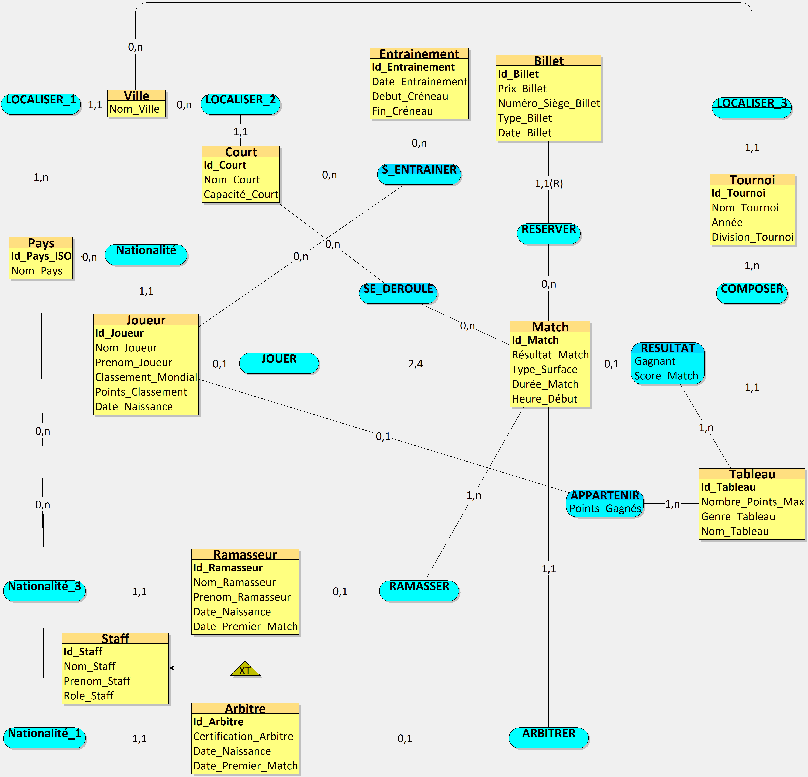

# Projet : Système de Gestion de tournoi de tennis

---

## 1. Démarche et Conception (Étape 1)

### Prompt Final utilisé

>Tu travailles dans le domaine de l’organisation de compétitions de tennis internationales. Ton organisation a comme activité de gérer intégralement le cycle de vie d'un tournoi professionnel, incluant la planification des matchs sur les courts, la vente de billets au public, le calcul des points pour le classement mondial, l'affectation du staff technique (arbitres, ramasseurs) et la gestion des créneaux d'entraînement des joueurs. C’est une organisation comme l’ATP (Association of Tennis Professionals), la WTA ou la Fédération Française de Tennis (FFT). Les données collectées concernent l'identité des joueurs et du staff, les caractéristiques physiques des infrastructures, les détails des transactions de billetterie, les feuilles de match et les journaux d'accès aux terrains d'entraînement. Inspire-toi des sites web officiels de l'ATP Tour (atptour.com) pour la structure des classements et du guide d'arbitrage de l'ITF (itftennis.com) suivant : Règlements officiels de l'arbitrage et du classement technique. 
>Ton organisation veut appliquer MERISE pour concevoir un système d'information. Tu es chargé de la partie analyse, c’est-à-dire de collecter les besoins auprès de l’entreprise. Elle a fait appel à un étudiant en ingénierie informatique pour réaliser ce projet, tu dois lui fournir les informations nécessaires pour qu’il applique ensuite lui-même les étapes suivantes de conception et développement de la base de données. 
>D’abord, établis les règles de gestions des données de ton organisation, sous la forme d'une liste à puce. Elle doit correspondre aux informations que fournit quelqu’un qui connaît le fonctionnement de l’entreprise, mais pas comment se construit un système d’information. 
>Ensuite, à partir de ces règles, fournis un dictionnaire de données brutes avec les colonnes suivantes, regroupées dans un tableau : signification de la donnée, type, taille en nombre de caractères ou de chiffres. Il doit y avoir entre 25 et 35 données. Il sert à fournir des informations supplémentaires sur chaque donnée (taille et type) mais sans a priori sur comment les données vont être modélisées ensuite. 
>Fournis donc les règles de gestion et le dictionnaire de données.

### Règles Métier Obtenues

*Voici les règles de gestion générées par l'IAG Gémini 3 :*

1. Identité et Staff : Chaque joueur et membre du staff technique (arbitre, ramasseur) possède un identifiant unique, un nom, un prénom, une nationalité et une date de naissance.

2. Classement Mondial : Un joueur possède un nombre de points total et un rang mondial qui évoluent après chaque tournoi.

3. Infrastructures : Un tournoi se déroule sur plusieurs courts. Chaque court a un nom (ex: "Philippe Chatrier"), une capacité de spectateurs et une surface spécifique (Terre battue, Gazon, Dur).

4. Planification des Matchs : Un match oppose soit deux joueurs (Simple), soit deux paires (Double). Il est programmé sur un court précis à une date et une heure données.

5. Arbitrage : Un match est supervisé par un arbitre de chaise principal. Un arbitre possède une certification (Bronze, Silver, Gold Badge).

6. Résultats : Pour chaque match, on enregistre le score par set (ex: 6-4, 3-6, 7-5) et la durée totale de la rencontre.

7. Billetterie : Un billet est vendu pour un court spécifique et une date précise. Il comporte un prix, un numéro de siège et un type de catégorie (Standard, VIP, Loge).

8. Logistique d'entraînement : Les joueurs réservent des créneaux d'entraînement. Un créneau est défini par une heure de début, une heure de fin et un court assigné.

9. Ramasseurs de balles : Une équipe de plusieurs ramasseurs est affectée à chaque match pour assister les joueurs.

### Dictionnaire de Données

| Signification de la donnée | Type | Taille (car.) |
| :--- | :--- | :--- |
| Identifiant unique du joueur | Alphanumérique | 10 |
| Nom du joueur | Texte | 50 |
| Prénom du joueur | Texte | 50 |
| Nationalité (Code ISO) | Texte | 3 |
| Date de naissance | Date | 10 |
| Nombre de points au classement ATP/WTA | Numérique | 6 |
| Rang mondial actuel | Numérique | 4 |
| Identifiant du membre du staff | Alphanumérique | 10 |
| "Rôle du staff (Arbitre, Ramasseur)" | Texte | 20 |
| Niveau de certification de l'arbitre | Texte | 15 |
| Identifiant du court | Alphanumérique | 5 |
| Nom du court | Texte | 30 |
| Type de surface (ex: Terre battue) | Texte | 20 |
| Capacité d'accueil du court | Numérique | 5 |
| Identifiant du match | Alphanumérique | 12 |
| Date du match | Date | 10 |
| Heure de début du match | Heure | 5 |
| Score final du match (format texte) | Texte | 30 |
| Durée du match (en minutes) | Numérique | 3 |
| Identifiant du billet | Alphanumérique | 15 |
| Prix du billet | Numérique (Décimal) | 7 |
| Numéro de siège | Alphanumérique | 5 |
| Catégorie du billet | Texte | 15 |
| Date de validité du billet | Date | 10 |
| Identifiant du créneau d'entraînement | Alphanumérique | 10 |
| Heure de début d'entraînement | Heure | 5 |
| Heure de fin d'entraînement | Heure | 5 |
| Point gagné par le vainqueur du match | Numérique | 4 |
| "Genre du tournoi (Simple Messieurs, Double Dames, etc.)" | Texte | 20 |
| "État du match (Programmé, En cours, Terminé)" | Texte | 15 |

---

## 2. Modélisation (Étape 2)

### Modèle Conceptuel des Données (MCD)

*Le fichier source au format '.loo' est disponible dans le dépôt : [Voir le fichier source](./Looping_Mini-Projet.loo)*

### Modèle Logique des Données (MLD)

---

## Contenu du Répertoir

* 'README.md' : Documentation, Règles Métier, Prompt, Dictionnaire et Image MCD. 
* 'Looping_Mini-Projet.loo' : Fichier source Looping. 
* 'MCD_Mini-Projet.png' : Image du Modèle. 
* 'structure.sql' : Script SQL vide pour le moment.
